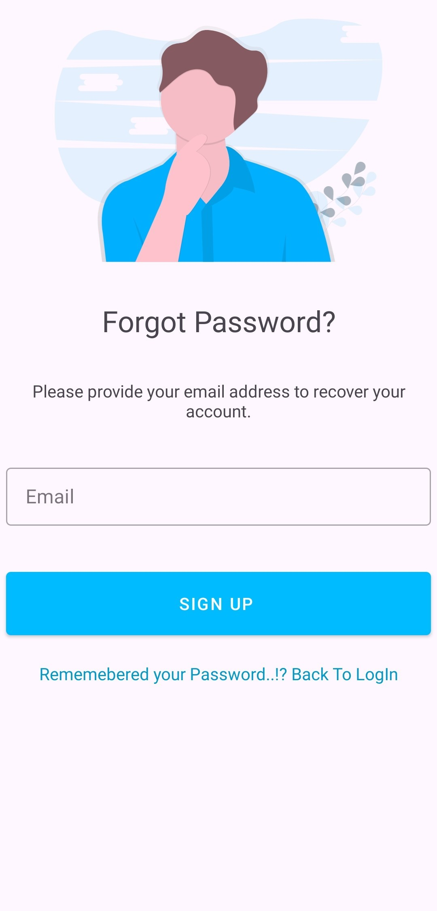

# 🎉 Event Management System

> **2nd Semester MCA Project**  
> A modern and intuitive platform to manage events, enabling users to create, browse, and register for events seamlessly.

---

## 🌟 Overview

The **Event Management System** is designed to simplify how events are created, managed, and attended.  
It provides **users** the ability to explore events and register quickly, while **admins** can create and monitor event activity.

📍 **Key Highlights**
- 🚀 Built using **Java** with **MVVM Architecture**  
- 🔐 Secure and reliable with **Firebase Realtime Database**  
- 📱 User-friendly interface designed for simplicity  
- 🎓 Developed as part of MCA Semester II academic project  

---

## 🛠️ Tech Stack

| Layer         | Technology |
|---------------|------------|
| Frontend/UI   | Java, XML (Android) |
| Architecture  | MVVM (Model-View-ViewModel) |
| Backend       | Firebase Realtime Database |
| Tools         | Android Studio, Git, GitHub, Gradle |

---

## ✨ Features

✅ **Create Events** – Organizers can add event details  
✅ **Browse Events** – Users can explore a list of events  
✅ **Register / RSVP** – Quick registration for events  
✅ **User Authentication** (if implemented)  
✅ **Admin Panel** (optional) – Manage approvals & registrations  

---

## 📂 Project Structure

EventManagement/
├── app/
│ ├── src/
│ │ ├── main/
│ │ │ ├── java/ # Application logic (MVVM layers)
│ │ │ └── res/ # Layouts, drawables, UI resources
│ └── build.gradle.kts
├── gradle/
├── build.gradle.kts
└── settings.gradle.kts

---

## 🖼️ Screenshots

**AdminSide**

<p align="center">
  
  
</p>

**UserSide**

<p align="center">
  
  
  
  
    
    
    
    
</p>

---

## 🚀 Getting Started

### 1️⃣ Clone the Repository
```bash
git clone https://github.com/Tejaskt/EventManagement.git
cd EventManagement

```

2️⃣ Open in Android Studio

Open the project folder in Android Studio.

Sync Gradle dependencies.

3️⃣ Configure Firebase

Add your google-services.json file inside app/.

Ensure Firebase Realtime Database is enabled in your Firebase console.

4️⃣ Run the App

Select an emulator or a connected device.

Press ▶️ Run to launch the app.

🏗️ Architecture

This project follows MVVM (Model-View-ViewModel) pattern:

Model → Handles data (Firebase Realtime DB)

View → UI components (Activities/Fragments)

ViewModel → Connects Model and View, holds business logic

Benefits:

Clear separation of concerns

Easier testing & debugging

Scalable codebase

🤝 Contributing

Contributions are welcome!

🍴 Fork the repo

🌿 Create a new branch (git checkout -b feature-name)

💾 Commit your changes (git commit -m "Add feature")

📤 Push to your branch (git push origin feature-name)

🔁 Open a Pull Request

🏆 Achievements

📚 Built as part of MCA Semester II project at Marwadi University

🥇 Leveraged real-world Firebase integration for event management

📜 License

This project is intended for academic and learning purposes.
You are free to explore and adapt with proper attribution.

👨‍💻 Author

Tejas Kanzariya

✨ If you like this project, don’t forget to give it a ⭐ on GitHub!
